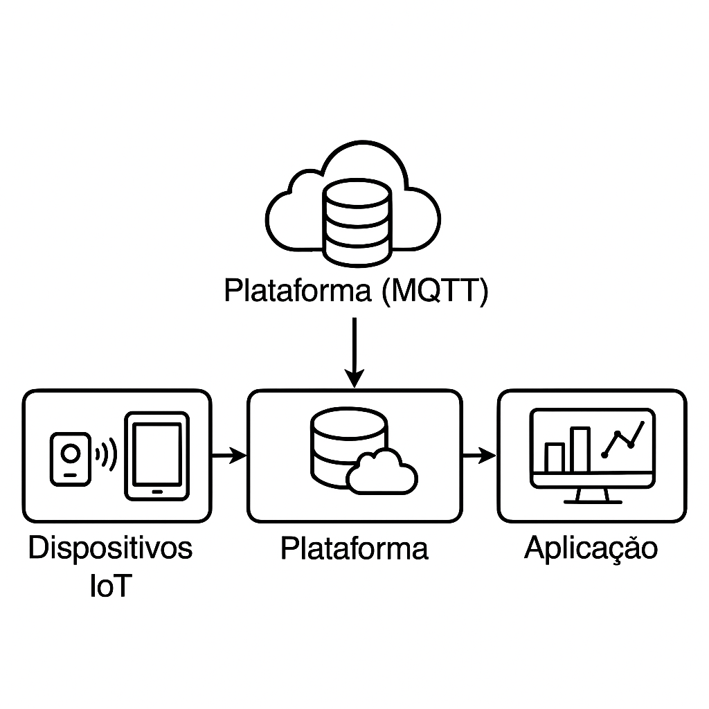

# TotemAI - Totem Interativo com Detecção de Gestos (Arduino + TagoIO + Node-RED)

## Descrição do Projeto
O TotemAI é um protótipo de totem interativo voltado para agilizar processos em ambientes hospitalares. Utilizando um Arduino Uno com sensor ultrassônico, o sistema detecta a aproximação da mão do usuário sem necessidade de toque físico. A interação é interpretada localmente (conceito de Edge Computing) e os dados são enviados para a plataforma TagoIO, podendo ser utilizados para acionar ações em sistemas via Node-RED.

O projeto visa demonstrar como soluções de IoT podem ser aplicadas para melhorar a experiência do paciente e otimizar o atendimento.

## Objetivo
O objetivo do TotemAI é melhorar a experiência dos usuários em hospitais:

- **Eliminar o uso de botões físicos** (higiênico e rápido).
- **Facilitar o acesso aos serviços de triagem e atendimento.**
- **Demonstrar o uso de tecnologias modernas de Edge Computing e IoT.**

## Funcionalidades
- **Detecção de Aproximação**: O sensor ultrassônico detecta gestos (passar a mão).
- **Geração de Evento**: Quando detectado, o Arduino envia uma mensagem para o TagoIO.
- **Automação Inteligente**: O Node-RED interpreta o evento e simula a abertura de menus ou execução de ações.
- **Monitoramento Serial**: O Arduino exibe mensagens via Monitor Serial para testes e validações.

## Requisitos do Sistema

### Hardware:
- Arduino UNO (ou compatível)
- Sensor Ultrassônico HC-SR04
- Protoboard e fios para conexões
- Fonte de energia 5V

### Software:
- Arduino IDE
- Conta no TagoIO
- Node-RED instalado (ou versão online)

## Dependências
- Biblioteca padrão do Arduino para comunicação serial.
- Integração via HTTP/MQTT com TagoIO (conceitual na simulação).
- Fluxos de automação simples no Node-RED.

## Instruções de Uso

### Passo 1: Conexões
#### Sensor Ultrassônico:
- **VCC → 5V do Arduino**
- **GND → GND do Arduino**
- **Trig → Pino Digital 9**
- **Echo → Pino Digital 10**

### Passo 2: Carregar o Código
1. Abra a IDE do Arduino.
2. Copie e cole o código fornecido.
3. Conecte o Arduino ao computador e selecione a porta correta.
4. Faça o upload do código para o Arduino.

### Passo 3: Simular/Testar o Sistema
1. Inicie a simulação no Wokwi ou teste fisicamente.
2. Passe a mão em frente ao sensor.
3. Veja a mensagem "ABRIR_MENU" ser exibida no Monitor Serial.
4. No fluxo de dados (simulado), o evento seria enviado ao TagoIO e interpretado pelo Node-RED.

## Diagrama do Sistema

## Vídeo do Projeto
[Inserir link para o vídeo de demonstração aqui]

## Integrantes
- Luiz Gustavo Araújo de Lima e Silva - RM560110
- Arthur Silva - RM560771
- Pedro Estevam - RM560642
- Matheus Siroma - RM560248
